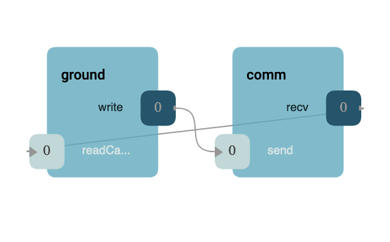

\page UartFramer UART Framer Component
# Drv::UartFramer UART Framer Component

The UART Framer Component is used to bridge the [Framer](../../Svc/Framer/docs/sdd.md) and 
[Deframer](../../Svc/Deframer/docs/sdd.md) components to the [Linux Serial Driver](../LinuxSerialDriver/) component.
Another UART driver could be used as long as it supports the same interfaces as the Linux Serial Driver.
This allows a connection to the F Prime [ground system](https://github.com/fprime-community/fprime-gds) via a standard
UART connection.


## Design

### Component Diagram


### Port List

|Port Name|Description|
|---|---|
|DeframerAllocate|Allocates buffers for the UART driver to send to the deframer via the UartFramer.|
|FramerDeallocate|Deallocate buffers sent by the framer|
|

### Initialization


**Callback Formation**



In the callback formation, the byte stream driver component initiates the transfer of received data by calling the
"readCallback" output port. This port transfers any read data in a `Fw::Buffer` along with a status for the receive.
This status is an enumeration whose values are described in the following table:

| Value | Description |
|---|---|
| Drv::RECV_OK    | Receive functioned normally buffer contains valid data. |
| Drv::RECV_ERROR | Receive produced an error and buffer contains no valid data. |

## Usage

The Drv::TcpClientComponentImpl must be configured with the address of the remote connection, and the socket must be
open to begin. Usually, the user runs the Drv::TcpClientComponentImpl engaging its read thread, which will automatically
open the  connection. The component is passive and has no commands meaning users should `init`, `configure`, and
`startSocketTask`. Upon shutdown, the `stopSocketThread` and `joinSocketThread` methods should be called to ensure
proper resource deallocation. This typical usage is shown in the C++ snippet below.

```c++
Drv::TcpClientComponentImpl comm = Drv::TcpClientComponentImpl("TCP Client");

bool constructApp(bool dump, U32 port_number, char* hostname) {
    ...
    comm.init(0);
    ...
    if (hostname != NULL && port_number != 0) {
        Os::TaskString name("ReceiveTask");
        comm.configure(hostname, port_number);
        comm.startSocketTask(name);
    }
}

void exitTasks(void) {
    ...
    comm.stopSocketTask();
    (void) comm.joinSocketTask(NULL);
}
```
## Class Diagram


## Requirements

| Name | Description | Validation |
|---|---|---|
| TCP-CLIENT-COMP-001 | The tcp client component shall implement the ByteStreamDriverModel  | inspection |
| TCP-CLIENT-COMP-002 | The tcp client component shall provide a read thread | unit test |
| TCP-CLIENT-COMP-003 | The tcp client component shall provide bidirectional communication with a tcp server | unit test |

## Change Log

| Date | Description |
|---|---|
| 2020-12-17 | Initial Draft |
| 2021-01-28 | Updated |
