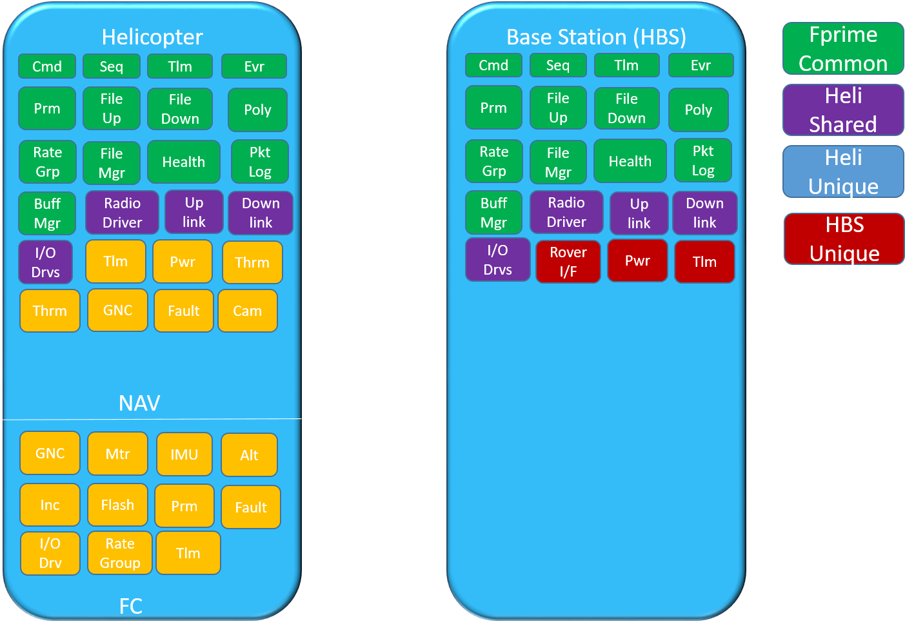

# Projects and Deployments

F´ is naturally organized into projects and deployments. Projects use F´ to solve some embedded system problem, and may
consist of one or more deployments. Deployments are tied to individual builds of code and are typically used to drive
a single device.

A topology is a specific set of interconnected components, which represents the design of a deployment. Further
explanation of projects and deployments and how they differ is explained in this guide.

- [Projects](#projects)
- [Deployments](#deployments)
- [Topologies](#topologies)
- [Conclusion](#conclusion)

To illustrate this, the Mars Helicopter project is an excellent example. The Mars Ingenuity Helicopter uses one project that defines
three deployments: one for the base station connected to the Perseverance Rover, and two for the Ingenuity helicopter. This is shown in Figure 1.

**Figure 1. Mars Helicopter flight software components.**

## Projects

A project may consist of one or more related deployments. Each deployment is one instance of F´ software. Projects are
used to organize F´ code that is closely related. They define at least one deployment (see above), but may define
multiple deployments. Component designs and source may be shared between these related deployments.

There are several reasons a project may contain multiple deployments.

1. A project consists of multiple spacecraft, electronic platforms, processors or systems. F´ can be used on multiple nodes in such systems.
2. A project has test deployments, simulation deployments, or other deployments that allow for specific testing setups.

Figure 1 shows an example of a project, the Mars Helicopter flight software, which was implemented with F´. The Mars
Helicopter is the project, but has two deployments: one designated for the helicopter, and one designated for the base
station.

## Deployments

Deployments are tied to builds; for each build of the code there is a single deployment. These deployments may share
components and ports from within the project, but the topology and the individual build of F´ are typically unique.

Deployments may define custom components and ports that are only used in that specific deployment. They may also inherit
other components, like those defined by the F´ framework. Each F´ deployment uses a set of components and ports,
and has a single topology. Components and ports are organized into the deployments topology to represent the behavior of
that deployment.

Deployments contain the needed build system artifacts to build the F´ framework, components, ports, and the topology
into an executable that can be deployed onto embedded hardware, or even run on the user’s computer.

In our example, multiple non-homogeneous systems are defined for the Mars Helicopter. It has multiple deployments as
each system would have a separate unique executable to control it.

## Topologies

A topology is a specific set of interconnected components that represent a system. Topologies contain instantiations of
each component, and list connections between the ports of the components.

Projects contain one or more deployments that are closely related, as discussed above, while deployments contain a
topology that represents the design of the system including, ports, and components needed for the specific use of F´.

## Conclusion

Projects are containers of related deployments to solve some problem. Deployments are a container for a topology and
build configuration to create an executable for a specific device used on the project.